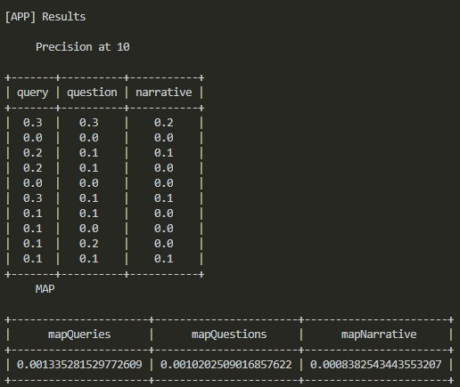

# Comparative analysis between types of queries and IR models using TREC-COVID
> This repository refers to the final work for Information Retrieval class, lectured by Professor Giseli Lopes of Computer Science Department at Universidade Federal do Rio de Janeiro.

This work aims to retrieve information and evaluation its results using as document collection a subset of [CORD-19](https://github.com/allenai/cord19) and [TREC-COVID's test collection](https://ir.nist.gov/covidSubmit/data.html). This repository has the report that talks about the whole project and the implementation itself. The results generated by this application is not satisfing in terms of precision but, with them, I could conclude interesting points related to quality of documents collection and the importance of tokenization and stemming. 

## Repository's organization
- ```RelatorioTrabFinalRI_TainaLima_v1.pdf``` contains the report about this project.
- ```\final_work_application``` contains the application that retrieves information and generate the values of P@10 and MAP metrics.


## Requirements
To execute this application you must have installed the following tools and libraries:
- Python 3.8.0 (maybe any 3.x works)
- [Pandas library](https://pandas.pydata.org/)
- IO, OS, datetime and CSV libraries (these are native from Python)
- XML library
- [rank_bm25 library](https://pypi.org/project/rank-bm25/) 
- [PrettyTable library](http://zetcode.com/python/prettytable/)

## How to run the application

After you download the application you must download the metadata file of CORD-19. For that, you acess this [site](https://ai2-semanticscholar-cord-19.s3-us-west-2.amazonaws.com/historical_releases.html) and follow the instructions where they explain how to download an specific file; using <data_iso_str> as '2020-07-16' (without quotes) and <file_name> as 'metadata.csv' (again, without quotes). <br>
Or you can just click [here](https://ai2-semanticscholar-cord-19.s3-us-west-2.amazonaws.com/2020-07-16/metadata.csv) to download the correct metadata file. <br>
You also must save this file with the name 'metadata_20200716.csv' and save it in ```final_work_application/data/in``` folder.<br>
Before you run it, you must open the file "main.py" and choose which IR model do you want to execute, changing the global variable which goes inside the function "run".
```python

BOOLEAN = 0
VECTORIAL = 1
PROBABILISTIC = 2


run(PROBABILISTIC)
```

Windows:
```sh
py main.py
```
or 
```sh
python main.py
```
## Usage example

If you execute "main.py" file using ```PROBABILISTIC```as parameter of ```run(model)``` function as following:
```python

run(PROBABILISTIC)
```

Besides log messages, you should get as outcome the ensuing result:<br>


## Built with
- Python 3.8.0 + libraries
- Visual Studio Code
- Windows 10

## Meta

Tainá Lima – tainaslima@gmail.com

[https://github.com/tainaslima](https://github.com/tainaslima)
